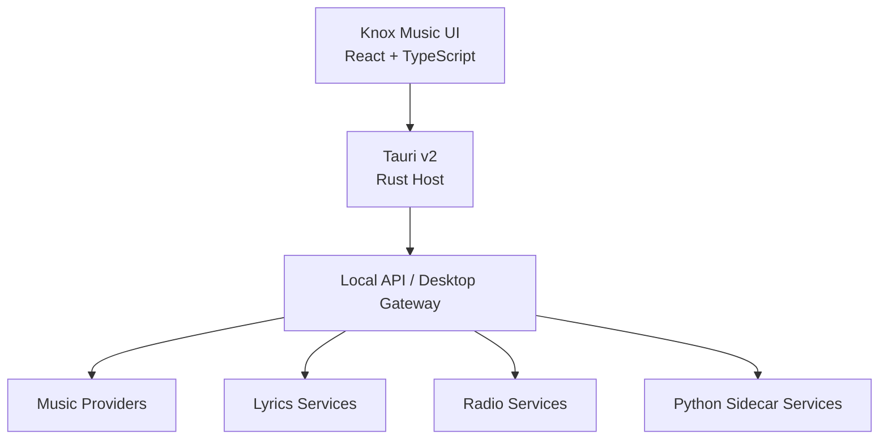

<div align="center">

  

  # 🎵 Knox Music

  ### A modern, beautiful and powerful music experience.

  Knox Music is a self-contained, local-first music application with a polished Liquid Glass dark interface — unifying music discovery, playback, lyrics, and radio in one app for desktop and Android.

  
  
  
  
  
  
  
  

  <br />

  [⬇️ Download](../../releases) &nbsp;·&nbsp; [📦 Releases](../../releases) &nbsp;·&nbsp; [📖 Documentation](#-architecture) &nbsp;·&nbsp; [🐛 Report a Bug](../../issues)

</div>

---

## ✨ About

**Knox Music** is designed as a modern music application with a polished interface and a local, self-contained architecture. Your device is the server — library, playback, downloads, and settings live on-device, with network traffic limited to the music providers you explicitly enable.

- Modern **Liquid Glass / dark premium UI**, responsive on desktop and mobile layouts
- **Music discovery** across multiple providers through a clean provider abstraction
- Full **playback** experience: queue, shuffle, repeat, seek, speed, sleep timer, Media Session / media keys
- **Lyrics** support (`.lrc`, synced where available)
- **Radio / discovery** for exploring stations and related music
- **Desktop + Android** support via Tauri v2
- **Local/self-contained architecture**: Tauri Rust host + local API/gateway + optional Python sidecar services
- Actively developed — current status: **Testing**

> **Honest provider model:** discovery-only providers and playable providers are clearly separated. Not every provider can play every track. See [Providers](#-providers--discovery) for details.

---

## 🚀 Features

| Feature | Description |
|---|---|
| 🎧 Music Playback | Play/pause, seek, shuffle, repeat, playback speed, queue, sleep timer, Media Session / media keys |
| 🔎 Music Discovery | Debounced search across songs, artists, albums, playlists, with history and offline search against the local database |
| 🎤 Lyrics | `.lrc` lyrics display, synced where the source provides timing ([TODO] confirm per-provider coverage) |
| 📻 Radio | Station browsing and playback via radio services (see Providers) |
| 🌐 Multiple Providers | Pluggable providers: local library, demo catalog, licensed APIs, and discovery-only metadata sources |
| 📚 Local Library | Import files/folders, background scanning, metadata editing, favorites, local playlists, local-only history |
| 📴 Offline Support | Save supported tracks for offline listening; separate offline library vs. temporary cache with storage limits |
| 🖥️ Desktop | Tauri v2 desktop host (Linux `.deb` / `.AppImage` confirmed — see Download) |
| 📱 Android | Android builds distributed as APK via GitHub Releases (experimental / testing) |
| 🎨 Liquid Glass UI | Premium dark-first glass interface with light/system themes, responsive desktop and mobile layouts |
| 🔒 Local Architecture | Dexie/IndexedDB on-device database, local API/desktop gateway, Python sidecar; no account, no vendor backend, no tracking |

> Features above reflect the current codebase. Anything uncertain is marked `planned`, `experimental`, or `[TODO]` elsewhere in this file.

---

## 📸 Screenshots

> **TODO:** Screenshots are not yet committed to this repository. Intended paths:
>
> - `docs/screenshots/desktop.png` — Desktop home + sidebar
> - `docs/screenshots/player.png` — Now Playing / queue / lyrics
> - `docs/screenshots/android.png` — Android layout + mini player
>
> To preview now, run `npm run dev` and open `http://localhost:5173` (Home, Search, Now Playing, Downloads).
> Contributions with screenshots/GIFs are welcome.

<!--
Uncomment once the files exist:


-->

---

## ⬇️ Download

Official installable builds are published through **GitHub Releases**.

| Version | Android APK | Status |
|---|---|---|
| v1.0.2 | [GitHub Release](../../releases) | Testing |
| v1.0.1 | [GitHub Release](../../releases) | Previous |
| v1.0.0 | [GitHub Release](../../releases) | Previous |

> APK files are distributed through GitHub Releases rather than stored directly in the Git repository.

Browse all builds: [📦 Releases](../../releases)

---

## 📱 Android Installation

1. Download the latest APK from [Releases](../../releases).
2. Open the APK file on your device.
3. Allow installation from the requested source if Android asks.
4. Install Knox Music.
5. Launch the application.

> Not available on the Play Store. Install only APKs downloaded from this repository's Releases page.

---

## 🖥️ Desktop Installation

Desktop builds are distributed through [GitHub Releases](../../releases).

Confirmed formats (per `src-tauri/tauri.conf.json`):

- Linux `.deb`
- Linux `.AppImage`

```bash
# Example (filenames vary per release — check the Releases page)
sudo dpkg -i Knox-Music_1.0.2_amd64.deb
# or
chmod +x Knox-Music_1.0.2_amd64.AppImage
./Knox-Music_1.0.2_amd64.AppImage
```

> Windows `.exe` / `.msi`, macOS `.dmg`: [Add confirmed platforms here] — not confirmed in the current Tauri bundle targets.

---

## 🧩 Supported Platforms

| Platform | Format | Status |
|---|---|---|
| Linux | `.deb`, `.AppImage` | Testing (confirmed bundle targets) |
| Android | `.apk` | Testing / experimental |
| Web / PWA | `dist/` (Vite build) | Development / preview (`npm run dev`, `npm run build`) |
| Windows / macOS | [TODO] | [Add confirmed platforms here] |

Web/PWA runs in any modern browser; the Tauri shell wraps `dist/` for native desktop and Android.

---

## 🏛️ Architecture

Self-contained, local-first: the React UI talks to a Tauri Rust host and a local API/desktop gateway. Providers, lyrics, radio, and the Python sidecar sit behind that gateway — never as hardcoded calls from the UI.



On-device core: Dexie/IndexedDB database · AudioEngine · DownloadManager · StorageManager · Settings. The YouTube Music sidecar (`services/youtubemusic`, stdlib-only Python) runs on loopback (`127.0.0.1`, dynamic port) and is health-checked by the app.

---

## 🌐 Providers & Discovery

Provider abstraction lives in `src/providers/` (`ProviderManager`, per-track capability resolution in `capabilities.ts`).

**Key rule: SEARCH ≠ STREAMING ≠ DOWNLOAD ≠ OFFLINE.** A track appearing in search does not imply it is playable, downloadable, or available offline.

### Playable providers

| Provider | Search | Playback | Notes |
|---|---|---|---|
| Local Library | Yes | Yes (full) | Your files/folders, fully offline |
| Demo / Sample Catalog | Yes | Yes | Sample MP3s for testing/demo purposes |
| Jamendo | Yes | Provider-controlled | Optional adapter; requires your own `client_id`; offline only where per-track licensing allows |
| AirBeats | Yes | Provider-controlled | Optional; lyrics not exposed by this API; rights belong to per-track holders |
| FreeToUse | Yes | Provider-controlled | [TODO] confirm streaming/download scope per track |
| Internet Archive | Yes | Provider-controlled | Stream URL resolved lazily at play time |

### Discovery-only providers (metadata only — never playable)

| Provider | Search | Playback | Download / Offline |
|---|---|---|---|
| YouTube Music (via Python sidecar) | Yes — artists, albums, artwork, durations | No | No — never downloadable or stored offline from this source |

Results from discovery-only sources are labeled **"Discovery"** in the UI.

### Lyrics & Radio

- **Lyrics:** `src/providers/lyrics/` (e.g. Lrclib, `.lrc` synced lyrics where available).
- **Radio:** `src/providers/radio/` (e.g. RadioBrowser station browsing).

> Only use providers whose API, license, and terms permit your intended playback and offline-storage behavior.

---

## 🛠️ Development

**Prerequisites:** Node.js 20+, Rust toolchain (for Tauri), Python 3 (for the sidecar, stdlib only — no `pip install` required).

```bash
git clone ../../
cd Knox-Music
npm install

npm run dev              # Vite dev server (http://localhost:5173)
npm run dev:youtubemusic # Python sidecar on :5000 (optional, for discovery provider)
npm test                 # Vitest unit + integration tests
npm run build            # tsc + vite build -> dist/
npm run preview          # preview production build

npm run desktop:dev      # Tauri desktop dev
npm run desktop:build    # Tauri desktop build (.deb / .AppImage)
npm run android:apk      # Tauri Android APK build
npm run test:rust        # Rust tests (src-tauri)
```

| Script | Purpose |
|---|---|
| `npm run dev` | Frontend dev server |
| `npm run build` | Type-check + production build |
| `npm test` / `test:coverage` | Vitest suite / coverage |
| `npm run lint` / `typecheck` | `tsc --noEmit` |
| `npm run desktop:dev` / `desktop:build` | Tauri desktop shell |
| `npm run android:dev` / `android:apk` | Tauri Android shell / APK |

Python sidecar health check: `GET http://127.0.0.1:5000/health` → `{"ok": true, "service": "knox-youtube-music"}`. If the sidecar is down, the YouTube Music provider is marked unavailable and the app continues normally.

---

## 📁 Project Structure

```
Knox-Music/
├── src/                    # React + TypeScript UI
│   ├── api/                # Local API / gateway client
│   ├── audio/              # AudioEngine, playback
│   ├── core/               # Types, capability model
│   ├── providers/          # Jamendo, FreeToUse, AirBeats,
│   │                       # internet-archive, youtubeMusic (discovery-only),
│   │                       # local, lyrics/, radio/
│   ├── library/ search/    # Library, search, discovery
│   ├── downloads/ storage/ # DownloadManager, StorageManager, Dexie DB
│   ├── screens/ ui/ styles/# Screens, components, Liquid Glass theme
│   └── desktop/            # Tauri-specific integrations
├── src-tauri/              # Tauri v2 Rust host (axum local API, IPC)
│   ├── tauri.conf.json     # Bundle targets: deb, appimage
│   └── gen/android/        # Android generated shell
├── services/youtubemusic/  # Python sidecar (discovery/metadata only)
├── public/icons/           # App icons + PWA manifest assets
├── vite.config.ts          # Vite + PWA + dev proxies
└── LICENSE                 # MIT
```

---

## 🗺️ Roadmap

- [ ] Desktop builds stabilization (Linux `.deb` / `.AppImage` beyond testing)
- [ ] Android APK stabilization (background audio, media notifications, scoped storage)
- [ ] Provider coverage matrix with per-track capability badges — `planned`
- [ ] Expanded lyrics coverage (synced `.lrc` where sources allow) — `planned`
- [ ] Radio: favorites, history, improved station metadata — `planned`
- [ ] Offline library polish: resumable/atomic downloads, storage limits, auto-cleanup — `experimental`
- [ ] Accessibility: keyboard shortcuts, screen-reader labels, reduced-motion — in progress
- [ ] [TODO] Add confirmed Windows/macOS packaging targets if/when decided

---

## 📜 Version History

| Version | Notes |
|---|---|
| **v1.0.2** | Current — Testing / active development. Desktop + Android via GitHub Releases. |
| v1.0.1 | Previous release. See [Releases](../../releases) for notes. |
| v1.0.0 | Previous release. See [Releases](../../releases) for notes. |

> `package.json` / `src-tauri/tauri.conf.json` are the source of truth for the in-app version (`src/appVersion.ts` reads it live).

---

## ❓ Troubleshooting

| Issue | Fix |
|---|---|
| Android blocks install | Allow "Install from this source" for your browser/file manager, then retry the APK from [Releases](../../releases) |
| `.AppImage` won't launch | `chmod +x *.AppImage` first; install GStreamer plugin packages listed in `src-tauri/tauri.conf.json` if audio fails |
| `.deb` dependency errors | `sudo apt --fix-broken install` after `dpkg -i`; ensure WebKitGTK dependencies are present |
| Dev server CORS errors | Use the Vite proxies in `vite.config.ts` (`/api/freetouse`, `/api/jamendo`, `/api/archive`) rather than direct browser fetches |
| YouTube Music shows "unavailable" | Start the sidecar (`npm run dev:youtubemusic`), check `GET /health`, then toggle Settings → Providers → YouTube Music |
| Search works but track won't play | Expected for discovery-only results — check the provider badge; only playable providers stream |
| Port 5173 busy | Stop the other Vite instance or set `--port` explicitly |

Still stuck? [Report a Bug](../../issues) with app version, platform, and steps to reproduce.

---

## 🤝 Contributing

Contributions are welcome — code, providers, themes, tests, docs, and screenshots.

1. Fork the repo and create a feature branch.
2. Run `npm install`, `npm run dev`, `npm test`.
3. Keep provider capabilities honest (search ≠ streaming ≠ download).
4. Open a Pull Request describing what changed and how you tested it.

Please respect provider licenses and never add stream-ripping, DRM bypass, or credential harvesting.

---

## 📄 License

MIT — see [LICENSE](./LICENSE).

---

## 🙏 Credits

- Developer / organization: **Knox-knx**
- Built with: Vite, React, TypeScript, Tauri v2, Rust, Android, Python sidecar services
- Lyrics: Lrclib-compatible sources · Radio: RadioBrowser-compatible sources · Demo audio: SoundHelix samples
- Icons: `public/icons/` · Fonts/themes: in-repo Liquid Glass style system

---

## ⚠️ Disclaimer

Knox Music is a local-first player and discovery client. Audio rights belong to their respective copyright holders and provider terms apply. Discovery-only metadata sources provide artwork and catalog info only and do not grant playback or download rights. This software does not circumvent DRM, extract protected streams, or redistribute copyrighted audio. Use only providers and content you are licensed or otherwise permitted to play and store.
